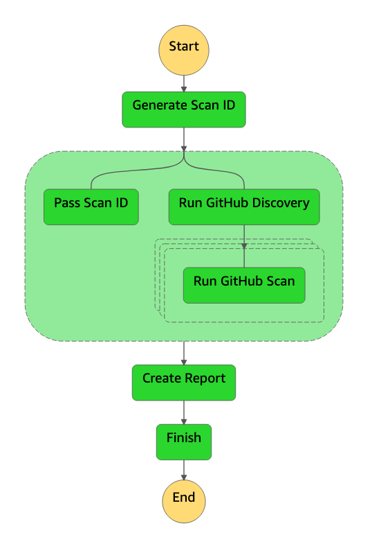

github-serverless-scan
======================

Scan your GitHub repositories with CloudFormation or AWS SAM code with cfn-lint. The stack deploys two Lambda functions, a Step Function and a DynamoDB table as shown below. You can invoke the scan using the Step Function which is provisioned. After a scan, you can review the results in the DynamoDB table. 

Installation
------------

Run 'bash deploy.sh' in the root of the directory to deploy the stack. The neccesary infrastructure and dependancies will be built and provisioned automatically. 

Roadmap
-------

- [ ] Add CDK support if this is feasible to run in Lambda in order to run 'cdk synth' to generate CloudFormation output. This would allow CDK repo's to be scanned for misconfigurations as well. 
- [ ] Add other security infrastructure as code scanning software, such as Checkov. 
- [X] Create an easy export function to generate reports (i.e. as a CSV file or as a CloudWatch/QuickSight dashboard). 
- [X] Convert the SQS setup to Step Functions, in order to provide more powerful scanning patterns and better debugging of scan results. 
- [X] Add more intelligent retrieval of feature branches, right now only the main one is downloaded.

Contact
-------

In case you have any suggestions, questions or remarks, please raise an issue or reach out to @marekq.
